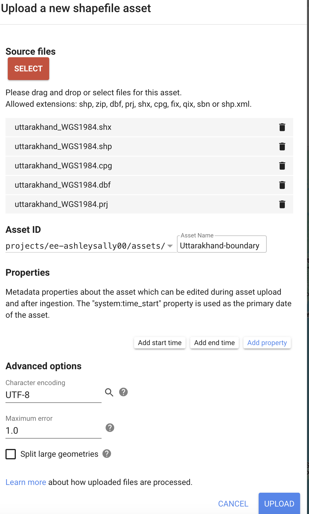
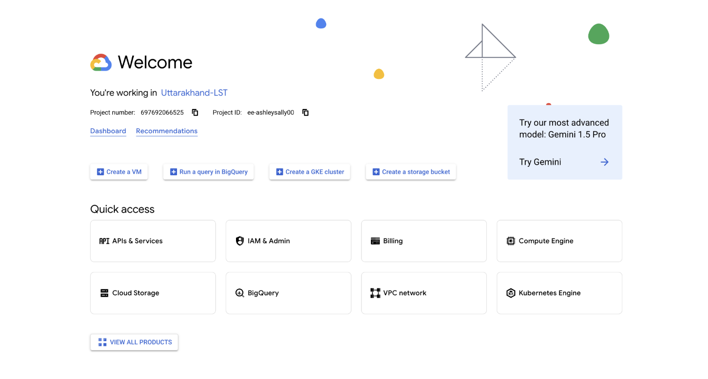
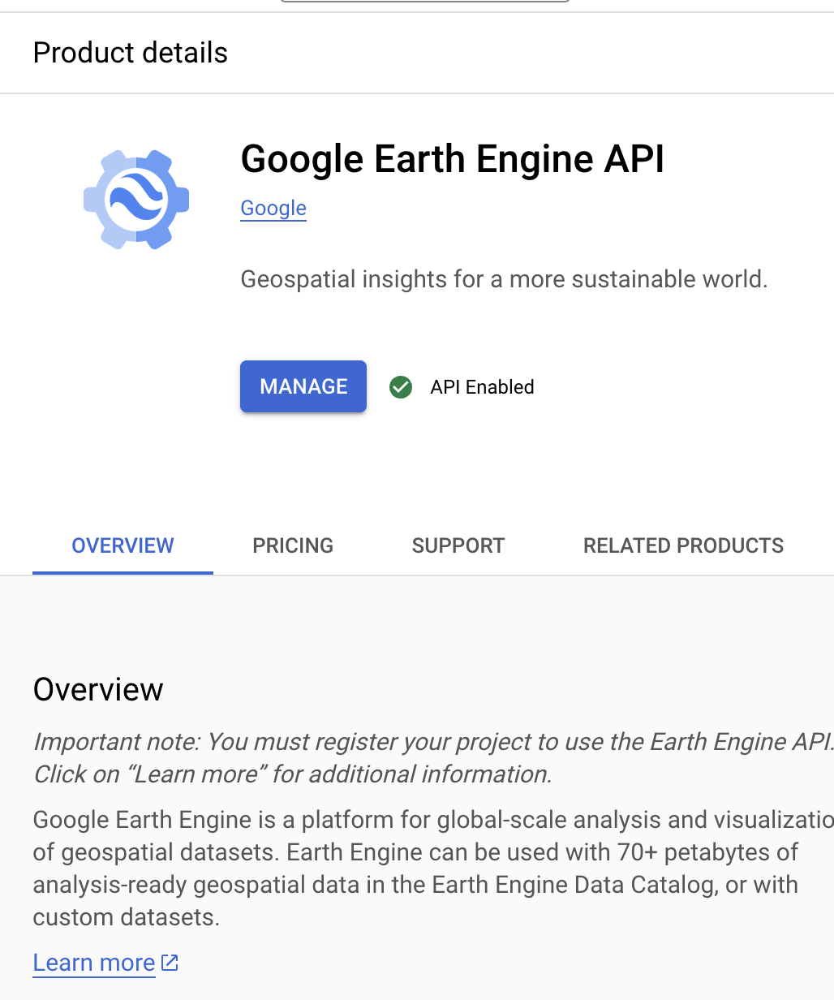

# Uttarakhand Land Surface Temperature (LST) Analysis for Fire Prediction ML

[](https://doi.org/10.5281/zenodo.17247724)


 ## Uttarakhand Land Surface Temperature (LST) Analysis for Fire Prediction ML

We worked together as an international team through Omdena to build an AI-powered forest fire prediction and early warning system for Uttarakhand, India. Using satellite-based Land Surface Temperature (LST) data, Google Earth Engine, and Python, our goal was to understand how ground temperature patterns influence wildfire behavior and improve early detection strategies.
This repository contains my individual contribution to Omdena’s *AI-Powered Forest Fire Prediction and Early Warning System for Uttarakhand*. I carried out preprocessing and exploratory data analysis of Land Surface Temperature (LST) data using Google Earth Engine (via its Python API), and I wrote the onboarding documentation to help collaborators set up and reproduce the workflow. I also conducted domain research, including an [interview with a California wildfire Public Information Officer](Interview-with-wildfire-PIO.md), to ensure the features and workflow aligned with real-world fire management needs.

Land Surface Temperature (LST) measures the temperature of the Earth's surface, which includes soil, vegetation, and built-up areas. It is derived from satellite thermal infrared data and reflects the heat emitted from the ground. This thermal information helps assess how different surfaces interact with heat - a critical factor in determining wildfire risk. <br> <br>
___
To better predict how fires might behave in the future, we analyzed data from **January 2012 to June 30, 2024**, focusing on Uttarakhand (though you can modify the geographic region to suit your specific research).

The analysis uses Google Earth Engine (GEE) to process the `MODIS/061/MOD11A1` dataset. The data is clipped to any user-defined region using a shapefile, resampled to 500m resolution, and exported for further analysis.

The files for the mean LST day and for 2024 mean LST day and 2024 mean LST night are too large to include directly in this repository. However, if you'd like to access them, you can view or download them from my DagsHub repository: [Uttarakhand-Land-Surface-Temperature-LST-Analysis-Using-GEE](https://dagshub.com/ashleysally00/Uttarakhand-Land-Surface-Temperature-LST-Analysis-Using-GEE). Please note: You may need to sign in to DagsHub to download large files, even though the repository is public.

## Collaborator Checklist
Before starting work on this project, ensure you have:
- [ ] Google account with access to Google Colab
- [ ] Google Earth Engine account with approved access
- [ ] Google Cloud Console project set up
- [ ] Google Drive API enabled (if planning to export results)
- [ ] Access to the project's shapefile assets
- [ ] Tested your GEE authentication in Colab

## Table of Contents
1. [Objective](#objective)  
2. [My Contributions](#my-contributions)  
3. [Requirements](#requirements)  
4. [Setup Instructions](#setup-instructions)  
5. [Data Workflow](#data-workflow)  
6. [How to Use](#how-to-use)  
7. [Output](#output)  
8. [Handling Task Queue Errors](#handling-task-queue-errors)  
9. [Further Exploration](#further-exploration)  
10. [Data Visualization](https://github.com/ashleysally00/Uttarakhand-Land-Surface-Temperature-LST-Analysis-Using-GEE/blob/main/data-visualization-maps-LST.md)  
11. [Glossary & Terms](https://github.com/ashleysally00/Uttarakhand-Land-Surface-Temperature-LST-Analysis-Using-GEE/blob/main/understanding-the-data.md) – *definitions of key terms like LST and other technical concepts used in this project*


## Objective

This project provides a framework for analyzing daily LST data for any user-defined region. It is designed to:
- Extract daytime and nighttime LST data from the MODIS `MOD11A1` dataset
- Allow users to specify their region of interest (ROI) by uploading a shapefile
- Resample the data from 1 km to 500m resolution for more accurate analysis

## Requirements

To reproduce the results, the following tools and libraries are required:
- A Google account with access to:
  - [Google Earth Engine](https://earthengine.google.com/)
  - [Google Cloud Console](https://console.cloud.google.com/)
  - [Google Colab](https://colab.research.google.com/)
- Python libraries:
  - `earthengine-api`
  - `geemap`
___
## Setup Instructions

### Google Earth Engine
1. **Register for Google Earth Engine**:
   - Visit [Google Earth Engine](https://earthengine.google.com/) and sign in with your Google account
   - Apply for access (if not already approved)

2. **Choose Your Account Type:**
   For academic research purposes, select "Unpaid Usage":

<p align="center">
  
</p>

<br>

- Once approved, you'll see the Code Editor interface:

<p align="center">
  
</p>

2. **Upload a Shapefile**:
   - Go to the **Earth Engine Code Editor**
   - In the **Assets** tab, click the "NEW" button and select "Shape files"
   - You'll see this upload interface:

<p align="center">
  
</p>


<br>
<br>
<br>
   - After successfully uploading, you'll see your shapefile in the Assets tab:
<br>
<br>
<br>
<br>


   - Note the **Asset ID** for use in your code
___   
### Google Cloud Console
1. **Create a Project**:
   - Go to [Google Cloud Console](https://console.cloud.google.com/)
   - Create a new project or select an existing one:

  

<br>

2. **Enable Earth Engine API**:
   - In the **APIs & Services > Library** section, search for **Earth Engine API**
   - You should see the following screen:


   
   - Click "MANAGE" or "ENABLE" (if not already enabled)
   - When successfully enabled, you'll see a green checkmark with "API Enabled" as shown in the image above

3. **Optional: Enable Google Drive API**:
   - If exporting results to Google Drive, enable the **Google Drive API**
___
### Google Colab Setup
1. Open a new notebook in Colab

2. Install required libraries:
   ```bash
   !pip install earthengine-api geemap
   ```

3. Authenticate Earth Engine:
   ```python
   import ee
   ee.Authenticate()
   ee.Initialize()
   ```
___
## Data Workflow

1. **Load MODIS Dataset**:
   - The MODIS/061/MOD11A1 dataset is filtered for the user-specified time range

2. **Clip to User-Defined ROI**:
   - The dataset is clipped to the boundary defined by the uploaded shapefile

3. **Resample to 500m**:
   - The data is resampled from 1 km to 500m resolution using bilinear interpolation

4. **Extract and Scale LST**:
   - Daytime (LST_Day_1km) and nighttime (LST_Night_1km) bands are extracted
   - Data is scaled to Kelvin (value * 0.02)

5. **Export**:
   - Mean LST for the time range or daily time-series data is exported as GeoTIFF or CSV to Google Drive

## How to Use

1. **Open the Colab Notebook:**
   - Download the `.ipynb` file from the repository (`NB_Uttarakhand_LST_no_widgets.ipynb`) or run it directly in Colab

2. **Update the Parameters**:
   - Replace `users/your_username/Region_Boundary` with your shapefile's Asset ID
   - Specify the date range (e.g., 2012-01-01 to 2024-06-30)

3. **Run the Notebook**:
   - Authenticate GEE and Google Drive when prompted

4. **Download the Outputs**:
   - Access the exported files from your Google Drive folder (default: EarthEngineExports)
___
## Output

### 1. Mean LST (Day and Night)
- The Colab notebook processes and exports the **mean daytime and nighttime LST** data for the entire time range (**January 2012 to June 30, 2024**).
- These GeoTIFF files summarize the average Land Surface Temperature for the given period.
- **Accessing the Output**:
  - The files are saved in Google Drive under the folder `EarthEngineExports`.
  - The filenames are:
    - `Mean_LST_Day.tif` (for daytime mean)
    - `Mean_LST_Night.tif` (for nighttime mean).

### 2. Daily Time-Series LST (Day and Night)
To extract daily LST data for the specified time range (**January 2012 to June 30, 2024**), additional Python code needs to be added to the Colab notebook. This processes and exports daily LST data as GeoTIFF files for both daytime and nighttime.

### 3. Accessing Daily LST Outputs
- **Google Drive Location**:
  - Daily LST outputs are saved in the folder `EarthEngineExports/Daily` in your Google Drive.
  - Each file is named in the format:
    - `LST_Day_YYYY-MM-DD.tif` (e.g., `LST_Day_2012-01-01.tif` for daytime LST on January 1, 2012)
    - `LST_Night_YYYY-MM-DD.tif` (e.g., `LST_Night_2012-01-01.tif` for nighttime LST on January 1, 2012).

- **Processing Time**:
  - Exporting daily LST data for an extended time range (**January 2012 to June 30, 2024**) may take a while.
  - Below is an example of the Colab output during the process:


## Data Visualization
For a detailed analysis of the LST patterns and their implications for wildfire prediction, check out our <br>
[visualization documentation](https://github.com/ashleysally00/Uttarakhand-Land-Surface-Temperature-LST-Analysis-Using-GEE/blob/main/data-visualization-maps-LST.md). This includes:
* Mean Daytime and Nighttime LST maps for 2024
* Analysis of temperature patterns and their relationship to wildfire risk
* Detailed explanation of map features and interpretation

## Python Code for Daily LST Exports
Add the following Python code to the end of your Colab notebook to generate and export the daily LST data:

```python
import datetime
import ee

# Authenticate and initialize Earth Engine (if not already done)
ee.Authenticate()
ee.Initialize()

# Load the MODIS LST dataset
modis = ee.ImageCollection("MODIS/061/MOD11A1")

# Load the Uttarakhand shapefile (replace with your shapefile's Asset ID)
uttarakhand = ee.FeatureCollection("projects/ee-your-project-id/assets/Uttarakhand-boundary")

# Generate a list of dates from 2012-01-01 to 2024-06-30
start_date = datetime.date(2012, 1, 1)
end_date = datetime.date(2024, 6, 30)
dates = [start_date + datetime.timedelta(days=i) for i in range((end_date - start_date).days + 1)]

# Iterate through each date and process LST data
for date in dates:
    date_str = date.strftime('%Y-%m-%d')
    print(f"Processing LST data for {date_str}...")
    
    # Filter MODIS dataset for the specific date
    daily_modis = modis.filterDate(date_str, (date + datetime.timedelta(days=1)).strftime('%Y-%m-%d'))
    
    # Clip and resample to 500m
    daily_modis_clipped = daily_modis.map(lambda img: img.clip(uttarakhand))
    daily_modis_resampled = daily_modis_clipped.map(
        lambda img: img.resample('bilinear').reproject(crs='EPSG:4326', scale=500)
    )
    
    # Extract Daytime and Nighttime LST
    daily_lst_day = daily_modis_resampled.select('LST_Day_1km').mean().multiply(0.02).rename('LST_Day_K')
    daily_lst_night = daily_modis_resampled.select('LST_Night_1km').mean().multiply(0.02).rename('LST_Night_K')

    # Export daily data to Google Drive
    ee.batch.Export.image.toDrive(
        image=daily_lst_day,
        description=f'LST_Day_{date_str}',
        folder='EarthEngineExports/Daily',
        fileNamePrefix=f'LST_Day_{date_str}',
        region=uttarakhand.geometry(),
        scale=500,
        crs='EPSG:4326',
        maxPixels=1e13
    ).start()

    ee.batch.Export.image.toDrive(
        image=daily_lst_night,
        description=f'LST_Night_{date_str}',
        folder='EarthEngineExports/Daily',
        fileNamePrefix=f'LST_Night_{date_str}',
        region=uttarakhand.geometry(),
        scale=500,
        crs='EPSG:4326',
        maxPixels=1e13
    ).start()
```
## How to Monitor Your Export Progress

When processing large datasets, it's helpful to monitor the progress of your export tasks in the **Inspector Console** of the Google Earth Engine Code Editor. After you run the code to export files, you can check the **Tasks tab** to see the status of each export. This allows you to:

* Confirm that the export has started.
* See the approximate time it will take for the file(s) to download.
* Identify and debug any errors if the task fails.

Below is an example of what the **Inspector Console** looks like while a task is running:


## Steps to Monitor Exports

1. Go to the **Tasks tab** in the Google Earth Engine Code Editor.
2. Look for your export task(s). Each task will have:
   * **Phase**: This shows whether the task is queued, running, or completed.
   * **Submitted Time**: When the task was initiated.
   * **Estimated Time**: The approximate time left for completion (if available).
3. Wait for the task's status to change to **Completed**.
4. Once completed, the exported file(s) can be found in the folder you specified in your code (e.g., `EarthEngineExports` in Google Drive).


The following outputs are generated:

1. **Mean LST (Day and Night)**:
   - GeoTIFF files summarizing mean daytime and nighttime LST over the specified time range

2. **Daily Time-Series**:
   - A stack of daily LST data as GeoTIFF or CSV files for analysis

## References
- [Google Earth Engine Documentation](https://developers.google.com/earth-engine)
- [MODIS/061/MOD11A1 Dataset](https://developers.google.com/earth-engine/datasets/catalog/MODIS_061_MOD11A1)
- [Google Colab Documentation](https://colab.research.google.com/)

## Handling Task Queue Errors

When processing and downloading large datasets such as daily LST data over a long time range, you may encounter the following error:


### What Does This Mean?

This error occurs because Google Earth Engine enforces a limit of 3000 queued tasks per user. When exporting data for each day across multiple years, the number of tasks can easily exceed this limit.

### Solutions to Address the Task Limit

1. **Filter by Year and Process One Year at a Time**
   
   To avoid submitting too many tasks at once, you can filter the dataset to process and export data one year at a time:

   ```python
   # Define the year to process
   year = 2012
   start_date = datetime.date(year, 1, 1)
   end_date = datetime.date(year, 12, 31)
   dates = [start_date + datetime.timedelta(days=i) for i in range((end_date - start_date).days + 1)]

   # Iterate through each date and process LST data for the selected year
   for date in dates:
       date_str = date.strftime('%Y-%m-%d')
       print(f"Processing LST data for {date_str}...")
     
   ```

2. **Use Task Monitoring**
   
   To avoid overwhelming the task queue, modify the code to submit tasks one at a time and wait for their completion:

   ```python
   # Export daily data to Google Drive with task monitoring
   export_task_day = ee.batch.Export.image.toDrive(
       image=daily_lst_day,
       description=f'LST_Day_{date_str}',
       folder='EarthEngineExports/Daily',
       fileNamePrefix=f'LST_Day_{date_str}',
       region=uttarakhand.geometry(),
       scale=500,
       crs='EPSG:4326',
       maxPixels=1e13
   )
   export_task_day.start()

   export_task_night = ee.batch.Export.image.toDrive(
       image=daily_lst_night,
       description=f'LST_Night_{date_str}',
       folder='EarthEngineExports/Daily',
       fileNamePrefix=f'LST_Night_{date_str}',
       region=uttarakhand.geometry(),
       scale=500,
       crs='EPSG:4326',
       maxPixels=1e13
   )
   export_task_night.start()

   # Wait for the tasks to complete before starting the next iteration
   while export_task_day.active() or export_task_night.active():
       print(f"Waiting for tasks to complete for {date_str}...")
       time.sleep(60)  # Wait for 60 seconds before checking again
   ```

## Handling Exported LST Data from GEE and Uploading It to DagsHub for Use in Your Team Project

### Why Use DagsHub?
- **Large File Support**: Handle files that are too large for GitHub
- **Version Control for Data**: Manage your data with **DVC (Data Version Control)** or Git
- **Collaboration-Friendly**: Integrates seamlessly with GitHub for efficient teamwork

### Step 1: Create a DagsHub Account
1. Go to [DagsHub Sign Up](https://dagshub.com/user/sign_up) and **create an account** if you don't already have one
2. You can sign up using your GitHub or Google account, or by providing your email address
3. Verify your email address to activate your account
4. Once logged in, create a new repository for your project or use an existing one

### Step 2: Locate the GEE Files in Google Drive
1. After exporting data from GEE, navigate to your **Google Drive**
2. Find the folder with exported data. The files will typically have a `.tif` (GeoTIFF) file extension
3. Download the `.tif` files to your local machine

### Step 3: Upload Data to DagsHub

#### Upload Methods
1. **Connect Your GitHub Repository**:
   - Link your GitHub repository to DagsHub
   - Synchronize files and changes between the two platforms

2. **Using the Command Line Interface (CLI)**:
   - Open your terminal or the integrated CLI in Visual Studio Code
   - Navigate to the folder containing your `.tif` files
   - Add, commit, and push your files to DagsHub:
     ```bash
     git add your_file.tif
     git commit -m "Add LST data from GEE"
     git push origin main
     ```

3. **DagsHub GUI**:
   - Log in to [DagsHub](https://dagshub.com) and navigate to your repository
   - Use the **Upload** button to add your `.tif` files

   *Note: Some file types may not upload properly through the GUI. For large files or unsupported formats, use the CLI.*

## Further Exploration

If you'd like to delve deeper into the significance of this data and its role in wildfire prediction, explore the following resources:

1. **[Understanding the Data](https://github.com/ashleysally00/Uttarakhand-Land-Surface-Temperature-LST-Analysis-Using-GEE/blob/main/understanding-the-data.md)**:
   - This resource includes a detailed glossary to clarify key terms and concepts relevant to the analysis.

2. **[Interview with a Wildfire PIO](https://github.com/ashleysally00/Uttarakhand-Land-Surface-Temperature-LST-Analysis-Using-GEE/blob/main/Interview-with-wildfire-PIO.md)**:
   - Gain insights from a public infor## My Contributions

## My Contributions
This repository reflects my individual contribution to Omdena’s *AI-Powered Forest Fire Prediction and Early Warning System for Uttarakhand*. Specifically, I contributed by:

- **Data Collection & Preprocessing**  
  Processed MODIS LST data with Google Earth Engine (Python API), clipped to Uttarakhand boundaries, resampled to 500m, and exported for downstream ML modeling.

- **Exploratory Data Analysis (EDA)**  
  Generated visualizations of daytime and nighttime mean LST maps for 2024 (see [`data-visualization-maps-LST.md`](data-visualization-maps-LST.md)).

- **Onboarding Documentation**  
  Authored contributor guides, including setup instructions for GEE, Colab authentication, shapefile management, and error handling. These are documented in files such as `/understanding-the-data.md`, as well as embedded in the README.

- **Domain Research via PIO Interview**  
  Interviewed a California wildfire Public Information Officer / volunteer firefighter to gather practitioner perspectives on wildfire management and the potential usefulness of Land Surface Temperature data. The full interview is available in [`Interview-with-wildfire-PIO.md`](Interview-with-wildfire-PIO.md).

- **Collaboration & Knowledge Sharing**  
  Structured outputs (mean/day/night TIFFs, task error handling, visualization guides) to support teammates and ensure reproducibility across different platforms (Google Drive, GitHub, and DagsHub).

  ### How to Cite
Ashley Rice. *Interview with a Wildfire PIO and Volunteer Firefighter, Redding, California.* Zenodo (2025). https://doi.org/10.5281/zenodo.17247725  

See [ORCID profile](https://orcid.org/0009-0001-5972-2257) for related works.
